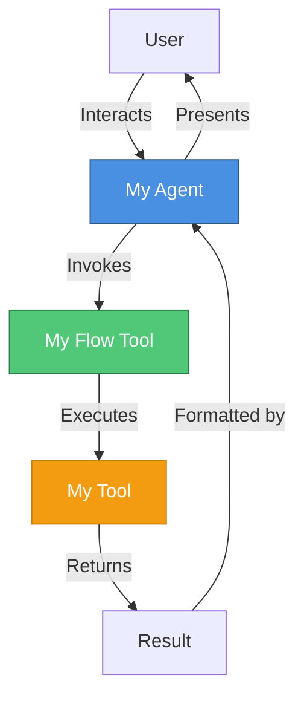
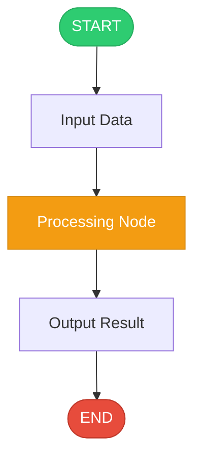
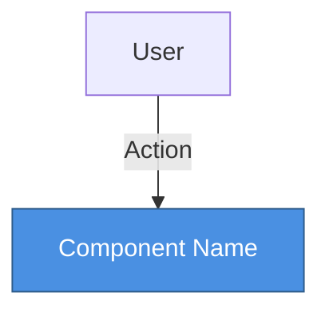
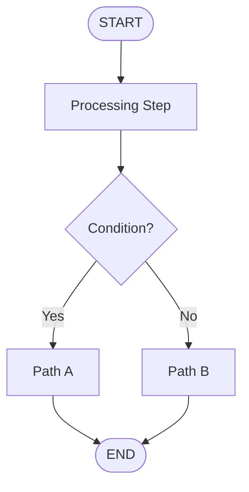

# watsonx Orchestrate (wxO) Implementation Guide

## Table of Contents
1. [Overview](#overview)
2. [Navigating the ADK](#navigating-the-adk)
3. [Core Concepts](#core-concepts)
4. [Example Categories](#example-categories)
5. [Standard Project Structure](#standard-project-structure)
6. [Implementation Patterns](#implementation-patterns)
7. [Quick Start Guide](#quick-start-guide)

---

## Overview

This guide helps you navigate the **IBM watsonx Orchestrate Agent Development Kit (ADK)** examples and use them as a basis for implementing new watsonx Orchestrate agents and tools projects.

**ADK Repository**: https://github.com/IBM/ibm-watsonx-orchestrate-adk

The ADK provides:
- **Python SDK** for programmatic agent development
- **CLI tool** (`orchestrate` command) for managing agents, tools, and environments
- **Developer Edition** - a local, self-contained instance of watsonx Orchestrate
- **Production Integration** - ability to deploy to production watsonx Orchestrate instances

---

## Navigating the ADK

### GitHub Repository

All examples and source code are available in the official GitHub repository:

**Repository**: [https://github.com/IBM/watsonx-orchestrate-adk](https://github.com/IBM/watsonx-orchestrate-adk)

### Key Directories in Repository

```
watsonx-orchestrate-adk/
├── examples/                         # Example implementations (START HERE)
│   ├── agent_builder/                # Agent examples
│   ├── flow_builder/                 # Flow examples
│   ├── channel-integrations/         # Channel integration examples
│   └── plugins/                      # Plugin examples
├── src/ibm_watsonx_orchestrate/     # SDK source (for reference)
│   ├── agent_builder/                # Agent creation APIs
│   ├── flow_builder/                 # Flow/workflow APIs
│   └── cli/                          # CLI commands
└── packages/                         # Additional packages
```

### How to Use This Guide

1. **Browse GitHub Examples** - Visit the [examples directory](https://github.com/IBM/watsonx-orchestrate-adk/tree/main/examples) to find examples similar to your use case
2. **Study Standard Structure** - Understand the consistent project layout
3. **Follow Implementation Patterns** - Use proven patterns for common scenarios
4. **Use Quick Start Guide** - Create new projects based on examples

---

## Core Concepts

### 1. **Agents**
AI assistants that can use tools and interact with users. Defined using YAML configuration:

```yaml
spec_version: v1
kind: native
name: my_agent
description: Agent description
instructions: Detailed instructions for the agent
llm: groq/openai/gpt-oss-120b
style: default
tools:
  - tool_name_1
  - tool_name_2
```

### 2. **Tools**
Functions that agents can invoke. Three main types:

- **Python Tools**: Python functions decorated with `@tool`
- **Flow Tools**: Workflows built with the flow builder
- **OpenAPI Tools**: REST APIs defined by OpenAPI specs

### 3. **Flows**
Workflows that orchestrate multiple steps, tools, and logic:

```python
from ibm_watsonx_orchestrate.flow_builder.flows import Flow, flow, START, END

@flow(
    name="my_flow",
    display_name="My Flow",
    description="Flow description",
    input_schema=MyInputSchema
)
def build_my_flow(aflow: Flow) -> Flow:
    # Define flow nodes and sequence
    node1 = aflow.tool(my_tool_function)
    node2 = aflow.llm(prompt="Process this: {input}")
    
    aflow.sequence(START, node1, node2, END)
    return aflow
```

**CRITICAL - Flow Function Signature:**
- Flow functions MUST follow this exact signature: `def build_<flow_name>(aflow: Flow) -> Flow:`
- The parameter MUST be named `aflow` with type `Flow`
- The function MUST return `Flow`
- The function name MUST start with `build_`
- Do NOT invent alternative signatures or parameter names

### 4. **Connections**
Authenticated connections to external services (ServiceNow, Salesforce, etc.)

### 5. **Knowledge Bases**
Document repositories that agents can search through for information

---

## Example Categories

### 1. **Agent Builder Examples**

Browse: [examples/agent_builder/](https://github.com/IBM/watsonx-orchestrate-adk/tree/main/examples/agent_builder)

#### Customer Care
- **Location**: [customer_care/](https://github.com/IBM/watsonx-orchestrate-adk/tree/main/examples/agent_builder/customer_care)
- **Purpose**: Healthcare customer service agent
- **Features**: ServiceNow integration, benefits queries, doctor search
- **Key Components**:
  - Agent YAML configuration
  - Python tools for API integration
  - Connection setup for ServiceNow

#### Voice-Enabled Agents
- [voice_enabled_deepgram/](https://github.com/IBM/watsonx-orchestrate-adk/tree/main/examples/agent_builder/voice_enabled_deepgram) - Deepgram voice integration
- [voice_enabled_elevenlabs/](https://github.com/IBM/watsonx-orchestrate-adk/tree/main/examples/agent_builder/voice_enabled_elevenlabs) - ElevenLabs voice integration
- [voice_enabled_watson/](https://github.com/IBM/watsonx-orchestrate-adk/tree/main/examples/agent_builder/voice_enabled_watson) - Watson voice integration

### 2. **Flow Builder Examples**

Browse: [examples/flow_builder/](https://github.com/IBM/watsonx-orchestrate-adk/tree/main/examples/flow_builder)

#### Simple Flows

**[hello_message_flow/](https://github.com/IBM/watsonx-orchestrate-adk/tree/main/examples/flow_builder/hello_message_flow)**
- **Purpose**: Basic flow demonstrating message generation
- **Pattern**: Simple tool invocation
- **Use Case**: Learning flow basics

**[get_pet_facts/](https://github.com/IBM/watsonx-orchestrate-adk/tree/main/examples/flow_builder/get_pet_facts)**
- **Purpose**: Fetch and display pet facts
- **Pattern**: External API integration
- **Use Case**: Simple data retrieval

#### Document Processing Flows

**[document_processing/](https://github.com/IBM/watsonx-orchestrate-adk/tree/main/examples/flow_builder/document_processing)**
- **Purpose**: Extract structured data from documents
- **Pattern**: Watson Document Understanding integration
- **Key Features**:
  - KVP (Key-Value Pair) schema definition
  - Document processing node (`docproc`)
  - Support for PDFs and images

**[document_classifier/](https://github.com/IBM/watsonx-orchestrate-adk/tree/main/examples/flow_builder/document_classifier)**
- **Purpose**: Classify documents by type
- **Pattern**: Document analysis and categorization

**[document_extractor/](https://github.com/IBM/watsonx-orchestrate-adk/tree/main/examples/flow_builder/document_extractor)**
- **Purpose**: General document data extraction
- **Pattern**: Flexible extraction framework
**[invoice_agent_6/](invoice_agent_6/)**
- **Purpose**: Extract structured data from invoices and receipts
- **Pattern**: Document processing with comprehensive KVP schema
- **Key Features**:
  - Extracts vendor information, invoice/receipt numbers, and dates
  - Itemizes line items with descriptions, quantities, and unit prices
  - Captures subtotal, tax, and total amounts
  - LLM-powered formatting for user-friendly output
  - Supports both invoices and receipts


#### Workflow Patterns

**[user_activity/](https://github.com/IBM/watsonx-orchestrate-adk/tree/main/examples/flow_builder/user_activity)**
- **Purpose**: Interactive user input collection
- **Pattern**: User activity nodes
- **Use Case**: Gathering structured user input

**[foreach_email/](https://github.com/IBM/watsonx-orchestrate-adk/tree/main/examples/flow_builder/foreach_email)**
- **Purpose**: Process multiple emails
- **Pattern**: Loop/iteration over collections
- **Use Case**: Batch processing

**[get_tuition_reimbursed/](https://github.com/IBM/watsonx-orchestrate-adk/tree/main/examples/flow_builder/get_tuition_reimbursed)**
- **Purpose**: Tuition reimbursement workflow
- **Pattern**: Multi-step approval process
- **Use Case**: Business process automation

#### Conditional Logic

**[get_pet_facts_if_else/](https://github.com/IBM/watsonx-orchestrate-adk/tree/main/examples/flow_builder/get_pet_facts_if_else)**
- **Purpose**: Conditional flow execution
- **Pattern**: If-else branching
- **Use Case**: Decision-based workflows

#### Advanced Patterns

**[collaborator_agents/](https://github.com/IBM/watsonx-orchestrate-adk/tree/main/examples/flow_builder/collaborator_agents)**
- **Purpose**: Multiple agents working together
- **Pattern**: Agent collaboration
- **Use Case**: Complex multi-agent scenarios

**[triage_workflow_agent_swarm/](https://github.com/IBM/watsonx-orchestrate-adk/tree/main/examples/flow_builder/triage_workflow_agent_swarm)**
- **Purpose**: Agent swarm for task distribution
- **Pattern**: Dynamic agent selection
- **Use Case**: Intelligent task routing

**[agent_scheduler/](https://github.com/IBM/watsonx-orchestrate-adk/tree/main/examples/flow_builder/agent_scheduler)**
- **Purpose**: Scheduled agent execution
- **Pattern**: Time-based triggers
- **Use Case**: Automated periodic tasks

---

## Standard Project Structure

Every example follows a consistent structure:

```
example_name/
├── __init__.py                    # Python package initialization
├── README.md                      # Documentation and usage instructions
├── main_flow.py                   # Programmatic testing script to test Flow.  Not needed if no flow is created.
├── import-all.sh                  # Import script for CLI
├── .env (optional)                # Environment variables
├── tools/                         # Tool implementations
│   ├── __init__.py
│   ├── tool_name.py              # Python tool definitions
│   └── flow_name.py              # Flow definitions
├── agents/                        # Agent configurations
│   └── agent_name.yaml           # Agent YAML files
└── generated/                     # Generated artifacts
    └── flow_spec.json            # Compiled flow specifications
```

### Key Files Explained

#### 1. **tools/[tool_name].py**
Python tools decorated with `@tool`:

```python
from ibm_watsonx_orchestrate.agent_builder.tools import tool, ToolPermission

@tool(permission=ToolPermission.READ_ONLY)
def my_tool(param: str) -> dict:
    """Tool description"""
    # Implementation
    return {"result": "value"}
```

#### 2. **tools/[flow_name].py**
Flow definitions using `@flow` decorator:

```python
from ibm_watsonx_orchestrate.flow_builder.flows import Flow, flow, START, END

@flow(
    name="my_flow",
    display_name="My Flow",
    description="Flow description",
    input_schema=InputSchema
)
def build_my_flow(aflow: Flow) -> Flow:
    # Build flow
    return aflow
```

**IMPORTANT - Flow Function Signature:**
- ALWAYS use: `def build_<flow_name>(aflow: Flow) -> Flow:`
- Parameter MUST be `aflow: Flow`
- Return type MUST be `Flow`
- Function name MUST start with `build_`

#### 3. **agents/[agent_name].yaml**
Agent configuration:

**CRITICAL - Required Agent YAML Fields:**
All agent YAML files MUST include these required fields:

```yaml
spec_version: v1                              # REQUIRED - Always use v1
kind: native                                  # REQUIRED - Use 'native' for standard agents
name: agent_name                              # REQUIRED - Unique agent identifier
description: Agent description                # REQUIRED - Clear description of agent purpose
instructions: Detailed instructions           # REQUIRED - Instructions for the LLM
llm: groq/openai/gpt-oss-120b  # REQUIRED - LLM model to use
style: default                                # REQUIRED - Agent style (default, react, etc.)
collaborators: []                             # OPTIONAL - List of collaborator agents
tools:                                        # REQUIRED - List of tools/flows
  - tool_or_flow_name
```

**DO NOT:**
- ❌ Omit `spec_version: v1` (will cause import errors)
- ❌ Omit `kind: native`
- ❌ Omit required fields like `llm`, `style`, or `tools`

#### 4. **main_flow.py**
Programmatic testing:

```python
import asyncio
from pathlib import Path
from examples.example_name.tools.flow_name import build_flow

async def main():
    flow_def = await build_flow().compile_deploy()
    generated_folder = f"{Path(__file__).resolve().parent}/generated"
    flow_def.dump_spec(f"{generated_folder}/flow.json")
    await flow_def.invoke({"input": "value"}, debug=True)

if __name__ == "__main__":
    asyncio.run(main())
```

#### 5. **import-all.sh**
CLI import script:

**CRITICAL - Import CLI Syntax:**
You MUST use the `orchestrate` CLI commands to import flows and agents. Do NOT use Python scripts or custom import methods.

```bash
#!/usr/bin/env bash

# orchestrate env activate local # only used if user asked to activate local env
SCRIPT_DIR=$( cd -- "$( dirname -- "${BASH_SOURCE[0]}" )" &> /dev/null && pwd )

# Import Python tools
for tool in tool1.py tool2.py; do
  orchestrate tools import -k python -f ${SCRIPT_DIR}/tools/${tool}
done

# Import Flow tools
for flow in flow1.py; do
  orchestrate tools import -k flow -f ${SCRIPT_DIR}/tools/${flow}
done

# Import agents
for agent in agent1.yaml; do
  orchestrate agents import -f ${SCRIPT_DIR}/agents/${agent}
done
```

**IMPORTANT - CLI Command Reference:**
- **Import Python Tools**: `orchestrate tools import -k python -f <path_to_tool.py>`
- **Import Flow Tools**: `orchestrate tools import -k flow -f <path_to_flow.py>`
- **Import Agents**: `orchestrate agents import -f <path_to_agent.yaml>`

**DO NOT:**
- ❌ Use custom Python import scripts (e.g., `python3 main_flow.py`)
- ❌ Use API client methods directly in import scripts
- ❌ Invent alternative import methods

**ALWAYS:**
- ✅ Use the `orchestrate` CLI commands shown above
- ✅ Use the `-k` flag to specify tool kind (python or flow)
- ✅ Use the `-f` flag to specify the file path
- ✅ Use `${SCRIPT_DIR}` for relative paths in the script

---

## Implementation Patterns

### Pattern 1: Simple Tool Flow

**Use Case**: Basic data retrieval or processing

**Structure**:
```
example/
├── tools/
│   ├── my_tool.py          # Python tool
│   └── my_flow.py          # Flow that uses the tool
├── agents/
│   └── my_agent.yaml       # Agent configuration
└── main.py                 # Testing script
```

**Example**: `get_pet_facts/`

### Pattern 2: Document Processing Flow

**Use Case**: Extract structured data from documents

**Structure**:
```
example/
├── tools/
│   ├── get_kvp_schemas.py  # Define extraction schema
│   └── processing_flow.py  # Document processing flow
├── agents/
│   └── doc_agent.yaml      # Agent configuration
└── main.py                 # Testing script
```

**Key Components**:
1. **KVP Schema Tool**: Defines what fields to extract
2. **Document Processing Node**: Uses Watson Document Understanding
3. **Flow**: Orchestrates schema retrieval and document processing

**IMPORTANT - Document Upload Handling**:
When a flow expects a document as input (e.g., `DocProcInput`), the agent should invoke the flow tool directly without asking the user to upload the document first. The flow itself will handle the document upload prompt.

- ✅ **Correct Agent Instructions**:
  ```yaml
  instructions: |
    When the user wants to process a document, immediately invoke the
    document_processing_flow tool. The flow will prompt the user to
    upload the document.
  ```

- ❌ **Incorrect Agent Instructions**:
  ```yaml
  instructions: |
    Ask the user to upload a document first, then pass it to the
    document_processing_flow tool.
    # This will NOT work - the agent cannot pass uploaded documents to flows
  ```

**Why**: Agents cannot directly pass user-uploaded documents to flow tools. The flow's document input nodes (like `docproc`) handle the upload interaction directly with the user. The agent should simply invoke the flow tool and let the flow manage the document upload process.

**Example**: `extract_airline_invoice/`, `document_processing/`, `expense_report_agent/`, `invoice_agent_6/`

### Pattern 3: User Activity Flow

**Use Case**: Interactive multi-step workflows

**Structure**:
```
example/
├── tools/
│   └── activity_flow.py    # Flow with user activity nodes
├── agents/
│   └── activity_agent.yaml # Agent configuration
└── main.py                 # Testing script
```

**Key Features**:
- User activity nodes for input collection
- Form handling
- Multi-turn conversations

**Example**: `user_activity/`, `book_a_flight/`

### Pattern 4: Multi-Agent Collaboration

**Use Case**: Complex tasks requiring multiple specialized agents

**Structure**:
```
example/
├── tools/
│   ├── agent1_tools.py     # Tools for agent 1
│   ├── agent2_tools.py     # Tools for agent 2
│   └── orchestration_flow.py # Coordination flow
├── agents/
│   ├── agent1.yaml         # Specialized agent 1
│   ├── agent2.yaml         # Specialized agent 2
│   └── coordinator.yaml    # Coordinator agent
└── main.py                 # Testing script
```

**Example**: `collaborator_agents/`, `triage_workflow_agent_swarm/`

---

## Quick Start Guide

### Creating a New Example

#### Step 1: Create Directory Structure

> **Note**: You can reference existing examples from the [GitHub repository](https://github.com/IBM/watsonx-orchestrate-adk/tree/main/examples) for structure and patterns.

```bash
mkdir -p my_example/{tools,agents,generated}
touch my_example/{__init__.py,main_flow.py,README.md,import-all.sh}
touch my_example/tools/__init__.py
```

#### Step 2: Create Python Tool (if needed)
```python
# tools/my_tool.py
from ibm_watsonx_orchestrate.agent_builder.tools import tool, ToolPermission

@tool(permission=ToolPermission.READ_ONLY)
def my_tool(input_param: str) -> dict:
    """Tool description"""
    return {"result": f"Processed: {input_param}"}
```

#### Step 3: Create Flow
```python
# tools/my_flow.py
from pydantic import BaseModel
from ibm_watsonx_orchestrate.flow_builder.flows import Flow, flow, START, END
from .my_tool import my_tool

class MyFlowInput(BaseModel):
    input_param: str

@flow(
    name="my_flow",
    display_name="My Flow",
    description="Flow description",
    input_schema=MyFlowInput
)
def build_my_flow(aflow: Flow) -> Flow:
    """
    CRITICAL: Flow function signature MUST be:
    def build_<flow_name>(aflow: Flow) -> Flow:
    """
    tool_node = aflow.tool(my_tool)
    aflow.sequence(START, tool_node, END)
    return aflow
```

#### Step 4: Create Agent Configuration
```yaml
# agents/my_agent.yaml
spec_version: v1
kind: native
name: my_agent
description: My agent description
instructions: Invoke my_flow tool and output the result
llm: groq/openai/gpt-oss-120b
style: default
tools:
  - my_flow
```

#### Step 5: Create Main Script (only needed if there are flows in the projects)

> **Tip**: See [flow examples](https://github.com/IBM/watsonx-orchestrate-adk/tree/main/examples/flow_builder) for complete working implementations.

```python
# main_flow.py
import asyncio
from pathlib import Path
from my_example.tools.my_flow import build_my_flow

async def main():
    flow_def = await build_my_flow().compile_deploy()
    generated_folder = f"{Path(__file__).resolve().parent}/generated"
    flow_def.dump_spec(f"{generated_folder}/my_flow.json")
    await flow_def.invoke({"input_param": "test"}, debug=True)

if __name__ == "__main__":
    asyncio.run(main())
```

#### Step 6: Create Import Script

**CRITICAL**: Always use the `orchestrate` CLI commands to import flows and agents.

```bash
# import-all.sh
#!/usr/bin/env bash

# orchestrate env activate local
SCRIPT_DIR=$( cd -- "$( dirname -- "${BASH_SOURCE[0]}" )" &> /dev/null && pwd )

# Import Python tools (if any)
for tool in my_tool.py; do
  orchestrate tools import -k python -f ${SCRIPT_DIR}/tools/${tool}
done

# Import Flow tools - MUST use: orchestrate tools import -k flow
for flow in my_flow.py; do
  orchestrate tools import -k flow -f ${SCRIPT_DIR}/tools/${flow}
done

# Import agents - MUST use: orchestrate agents import
for agent in my_agent.yaml; do
  orchestrate agents import -f ${SCRIPT_DIR}/agents/${agent}
done
```

**Required CLI Commands:**
- Python tools: `orchestrate tools import -k python -f <file>`
- Flow tools: `orchestrate tools import -k flow -f <file>`
- Agents: `orchestrate agents import -f <file>`

#### Step 7: Make Import Script Executable
```bash
chmod +x my_example/import-all.sh
```

#### Step 8: Create README with Diagrams

> **Examples**: Browse [GitHub examples](https://github.com/IBM/watsonx-orchestrate-adk/tree/main/examples) to see complete README files with diagrams.

```markdown
# My Example

## Overview
Brief description of what this example demonstrates.

## Architecture Diagram



## Workflow Diagram



## Usage

### Via Chat UI
1. Run `./import-all.sh`
2. Launch chat: `orchestrate chat start`
3. Select `my_agent`
4. Interact with the agent

### Programmatically
1. Set PYTHONPATH: `export PYTHONPATH=<ADK>/src:<ADK>`
2. Run: `python3 main.py`

## Features
- Feature 1
- Feature 2

## Output
Description of expected output
```

### Testing Your Example

#### Option 1: Via Chat UI
```bash
cd examples/category/my_example
./import-all.sh
orchestrate chat start
# Select your agent and interact
```

#### Option 2: Programmatically
```bash
export PYTHONPATH=/path/to/adk/src:/path/to/adk
cd examples/category/my_example
python3 main.py
```

---

## Best Practices

### 1. **Naming Conventions**
- Use snake_case for Python files and functions
- Use descriptive names that indicate purpose
- Agent names should match their YAML file names

### 2. **Documentation**
- Always include a README.md with:
  - Purpose and overview
  - **Architecture Diagram**: Mermaid diagram showing agent, flow, and tool relationships
  - **Workflow Diagram(s)**: One Mermaid diagram per agentic workflow showing the flow execution path
  - Usage instructions (both CLI and programmatic)
  - Expected inputs/outputs
  - Prerequisites or dependencies

#### Creating Effective Diagrams

**Architecture Diagram Guidelines:**
- Show the high-level system components (User → Agent → Flow → Tools/Services)
- Include external services or APIs being used
- Use consistent color coding (e.g., agents in blue, flows in green, tools in orange)
- Keep it simple and focused on the main interaction flow

**Workflow Diagram Guidelines:**
- Create one diagram per agentic workflow (flow tool)
- Show the complete flow from START to END
- Include all nodes: tool nodes, LLM nodes, decision points, user activity nodes
- Label branches clearly for conditional logic
- Use different colors for different node types
- Include key data transformations or processing steps

**Example Mermaid Syntax:**




### 4. **Error Handling**
- Include proper error handling in tools
- Provide meaningful error messages
- Use try-except blocks for external API calls

### 5. **Type Hints and Pydantic Models**
- Use Pydantic models for input/output schemas
- Include type hints in function signatures
- Document expected types in docstrings
- **IMPORTANT**: Always define Pydantic models explicitly as classes, never use dynamic type creation
  - ✅ **Correct**: Define models as proper classes
    ```python
    class MyOutputSchema(BaseModel):
        field_name: str = Field(description="Field description")
    ```
  - ❌ **Incorrect**: Do not use dynamic type creation
    ```python
    # This will cause Pydantic validation errors
    output_schema=type('MySchema', (BaseModel,), {
        'field_name': (str, Field(description="Field description"))
    })
    ```
  - All model fields must have proper type annotations
  - Dynamic type creation causes "non-annotated attribute" errors during model loading

### 6. **Credential Configuration**
- Use `expected_credentials` parameter in the `@tool` decorator to declare required connections
- Import `ExpectedCredentials` and `ConnectionType` from `ibm_watsonx_orchestrate.agent_builder.connections`
- **IMPORTANT**: The parameter name is `expected_credentials` (plural), not `expect_credentials`
- Pass a list of `ExpectedCredentials` objects, not plain dictionaries
- Each `ExpectedCredentials` object requires:
  - `app_id`: The connection identifier (must match the connection YAML name)
  - `type`: The authentication type from the `ConnectionType` enum
- **Common ConnectionType values**:
  - `ConnectionType.OAUTH2_AUTH_CODE` - For OAuth2 authorization code flow (Google, Microsoft, etc.)
  - `ConnectionType.BASIC_AUTH` - For basic username/password authentication
  - `ConnectionType.BEARER_TOKEN` - For bearer token authentication
  - `ConnectionType.API_KEY_AUTH` - For API key authentication
- ✅ **Correct**: Proper credential declaration
  ```python
  from ibm_watsonx_orchestrate.agent_builder.tools import tool
  from ibm_watsonx_orchestrate.agent_builder.connections import ConnectionType, ExpectedCredentials
  
  @tool(
      expected_credentials=[
          ExpectedCredentials(app_id="gmail_connection", type=ConnectionType.OAUTH2_AUTH_CODE)
      ]
  )
  def send_email(to: str, subject: str, body: str, credentials: dict):
      access_token = credentials.get("access_token")
      # Use access_token for API calls
  ```
- ❌ **Incorrect**: Common mistakes to avoid
  ```python
  # Wrong parameter name
  @tool(expect_credentials=...)  # Should be 'expected_credentials'
  
  # Wrong import
  from ibm_watsonx_orchestrate.agent_builder.tools import ExpectCredentials  # Does not exist
  
  # Using plain dict instead of ExpectedCredentials object
  @tool(expected_credentials=[{"app_id": "gmail", "type": "oauth2"}])  # Wrong
  
  # Including invalid 'fields' parameter
  @tool(expected_credentials=[
      ExpectedCredentials(app_id="gmail", fields=["access_token"])  # 'fields' not supported
  ])
  ```
- The framework automatically injects credentials at runtime based on the connection configuration
- Credentials are passed to the tool function via the `credentials` parameter

### 7. **Testing**
- Provide both CLI and programmatic testing methods
- Include example inputs in README
- Test with various input scenarios

### 8. **Modularity**
- Keep tools focused and single-purpose
- Separate concerns (tools, flows, agents)
- Reuse common utilities

---

## Common Patterns Reference

### Document Processing Pattern

#### Defining KVP Schemas with DocProcField

**IMPORTANT**: When creating KVP schemas for DocProcNode, you must use the `DocProcField` class to describe each field, not plain Python dictionaries. This ensures proper type validation and schema structure.

```python
from ibm_watsonx_orchestrate.flow_builder.types import (
    DocProcKVPSchema,
    DocProcField,
    DocProcOutputFormat,
)

# ✅ Correct - Using DocProcField class for field definitions
INVOICE_KVP_SCHEMA = DocProcKVPSchema(
    document_type="Invoice",
    document_description="A business invoice document with itemized line items",
    additional_prompt_instructions="Extract all values exactly as they appear in the document.",
    fields={
        "invoice_number": DocProcField(
            description="The unique identifier for the invoice",
            default="",
            example="INV-2024-001234",
        ),
        "invoice_date": DocProcField(
            description="The date the invoice was issued",
            default="",
            example="2024-01-15",
        ),
        "vendor_name": DocProcField(
            description="The name of the company or person issuing the invoice",
            default="",
            example="ABC Services Inc.",
        ),
        "total_amount": DocProcField(
            description="The final total amount due",
            default="",
            example="$6,464.25",
        ),
    }
)

# ❌ Incorrect - Using plain dictionaries (will cause errors)
WRONG_KVP_SCHEMA = {
    "document_type": "Invoice",
    "fields": {
        "invoice_number": {
            "description": "The unique identifier for the invoice",
            "example": "INV-2024-001234"
        }
    }
}
```

**Key Points:**
- Always import `DocProcKVPSchema` and `DocProcField` from `ibm_watsonx_orchestrate.flow_builder.types`
- Use `DocProcKVPSchema` to wrap the entire schema definition
- Use `DocProcField` for each field in the `fields` dictionary
- Each `DocProcField` should include:
  - `description`: Clear description of what the field contains
  - `default`: Default value (typically empty string for optional fields)
  - `example`: Example value to guide extraction

#### Complete Document Processing Flow Example

```python
from pydantic import BaseModel, Field
from ibm_watsonx_orchestrate.flow_builder.flows import Flow, flow, START, END
from ibm_watsonx_orchestrate.flow_builder.types import (
    DocProcInput,
    DocProcKVPSchema,
    DocProcField,
    DocProcOutputFormat,
)

# 1. Define KVP Schema using DocProcField
DOCUMENT_KVP_SCHEMA = DocProcKVPSchema(
    document_type="Invoice",
    document_description="Business invoice document",
    additional_prompt_instructions="Extract all values exactly as they appear.",
    fields={
        "field_name": DocProcField(
            description="Field description",
            default="",
            example="Example value",
        ),
    }
)

# 2. Create Document Processing Flow
@flow(name="doc_flow", input_schema=DocProcInput)
def build_doc_flow(aflow: Flow) -> Flow:
    """
    CRITICAL: Always use signature: def build_<flow_name>(aflow: Flow) -> Flow:
    """
    doc_node = aflow.docproc(
        name="extract_data",
        task="text_extraction",
        document_structure=True,
        enable_hw=True,
        output_format=DocProcOutputFormat.object,  # Returns JSON object instead of file reference
        kvp_schemas=[DOCUMENT_KVP_SCHEMA],  # Pass the schema directly
        kvp_force_schema_name="Invoice",
    )
    
    # Explicit input mapping
    doc_node.map_input(
        input_variable="document_ref",
        expression="flow.input.document_ref"
    )
    doc_node.map_input(
        input_variable="kvp_schemas",
        expression="flow.input.kvp_schemas"
    )
    
    aflow.sequence(START, doc_node, END)
    
    # IMPORTANT: KVPs have complex structure with key.semantic_label and value.raw_text
    # Recommended: Pass entire KVP array to a prompt node for formatting
    # See "CRITICAL: Document Processing KVP Structure" section below for details
    
    return aflow
```

**Alternative: Using Code Blocks or Python Tools for Complex Processing**

If you need custom Python logic that cannot be expressed in single-line expressions, you have two options:

1. **Code Block (Script Node)** - Faster, but with restrictions
   - Use `aflow.script()` to add a code block node
   - Executes Python code within the flow
   - **Restrictions**: Limited imports, no file I/O, restricted libraries
   - See: https://www.ibm.com/docs/en/watsonx/watson-orchestrate/base?topic=workflows-code-blocks

2. **Python Tool** - More flexible, but slower
   - Create a separate Python tool with `@tool` decorator
   - Can use any Python libraries and imports
   - Called as a tool node in the flow: `aflow.tool(my_tool_function)`
   - Better for complex logic, external API calls, or file operations

Example using code block for KVP processing:
```python
# Code block to extract specific KVP values
code_block = aflow.script(
    name="extract_kvp_values",
    code="""
# Extract values from KVP structure
vendor = next((kvp['value']['raw_text'] for kvp in kvps
               if kvp.get('key', {}).get('semantic_label') == 'vendor_name'), '')
total = next((kvp['value']['raw_text'] for kvp in kvps
              if kvp.get('key', {}).get('semantic_label') == 'total_amount'), '')
result = {'vendor': vendor, 'total': total}
""",
    input_schema=KVPInput,
    output_schema=ExtractedValues
)
```

**Recommendation**: For KVP processing, use a **prompt node** to format the data rather than code blocks or complex expressions. The LLM can intelligently parse the KVP structure and create user-friendly output.

**IMPORTANT: Prompt Node Requirements**
- The `system_prompt` parameter is **REQUIRED** for all prompt nodes
- It must be a string or list of strings defining the assistant's role
- Example: `system_prompt="You are a helpful assistant that formats data."`

**CRITICAL: Document Processing KVP Structure**

When using `output_format=DocProcOutputFormat.object` in docproc nodes, the `kvps` field is returned as a **list** of complex objects with the following structure:

```json
{
  "id": "KVP_000001",
  "type": "only_value",
  "key": {
    "id": "KEY_000001",
    "semantic_label": "vendor_name",
    "raw_text": null,
    "normalized_text": null,
    "confidence_score": null,
    "bbox": null
  },
  "value": {
    "id": "VALUE_000001",
    "raw_text": "ABC Store Inc.",
    "normalized_text": null,
    "confidence_score": 0.95,
    "bbox": {...}
  },
  "group_id": null,
  "table_id": null
}
```

**Key Points:**
- Each KVP has a `key` object with `semantic_label` (the field name from your schema)
- Each KVP has a `value` object with `raw_text` (the extracted value)
- To access a specific field, match the `semantic_label` and extract the `raw_text`

**Two Approaches to Handle KVPs:**

1. **Pass Entire KVP Array to Prompt Node** (Recommended)
   - Let an LLM format the complex KVP structure into user-friendly output
   - The prompt node receives the full KVP array and formats it

```python
# Create a prompt node to format KVPs
# IMPORTANT: system_prompt is REQUIRED for prompt nodes
summary_node = aflow.prompt(
    name="format_summary",
    system_prompt="You are a helpful assistant that formats data.",
    user_prompt=["Format this data: {kvps}"],
    output_schema=SummaryOutput
)

# Map the entire KVP array to the prompt
summary_node.map_input(
    input_variable="kvps",
    expression="flow['extract_data'].output.kvps"
)

# Output the formatted summary
aflow.map_output(
    output_variable="summary",
    expression="flow['format_summary'].output.summary"
)
```

2. **Extract Individual Fields Using List Comprehension**
   - Use single-line Python expressions in `map_output`
   - Match `semantic_label` and extract `raw_text`

```python
# ✅ Correct - Extract value by semantic_label using list comprehension
aflow.map_output(
    output_variable="vendor_name",
    expression="[kvp['value']['raw_text'] for kvp in flow['extract_data'].output.kvps if kvp.get('key', {}).get('semantic_label') == 'vendor_name'][0] if [kvp for kvp in flow['extract_data'].output.kvps if kvp.get('key', {}).get('semantic_label') == 'vendor_name'] else ''"
)

# ❌ Incorrect - Cannot use Python functions in expressions
def get_value(field):  # This won't work at runtime!
    return f"flow['node'].output.kvps[0].get('{field}')"

# ❌ Incorrect - Wrong structure (kvps is not a simple dictionary)
aflow.map_output(
    output_variable="vendor_name",
    expression="flow['extract_data'].output.kvps[0].get('vendor_name', '')"
)
```

**IMPORTANT: Expression Constraints**
- Output mapping expressions must be **single-line Python expressions**
- You **cannot define or call Python functions** in expressions
- Functions defined in your flow file are **not available at runtime**
- Use list comprehensions and inline logic only
- The flow engine evaluates expressions in its own runtime context

### User Activity Pattern
```python
@flow(name="user_flow", input_schema=InputSchema)
def build_user_flow(aflow: Flow) -> Flow:
    activity_node = aflow.user_activity(
        name="collect_input",
        display_name="Collect User Input",
        description="Gather information from user"
    )
    
    process_node = aflow.tool(process_data)
    
    aflow.sequence(START, activity_node, process_node, END)
    return aflow
```

### Conditional Flow Pattern
```python
@flow(name="conditional_flow", input_schema=InputSchema)
def build_conditional_flow(aflow: Flow) -> Flow:
    """
    CRITICAL: Always use signature: def build_<flow_name>(aflow: Flow) -> Flow:
    """
    check_node = aflow.tool(check_condition)
    
    true_branch = aflow.tool(handle_true)
    false_branch = aflow.tool(handle_false)
    
    aflow.sequence(START, check_node)
    aflow.if_else(
        condition="flow.check_node.output.is_valid",
        if_true=true_branch,
        if_false=false_branch
    )
    aflow.sequence(true_branch, END)
    aflow.sequence(false_branch, END)
    
    return aflow
```
---

## Additional Resources

- **Official Documentation**: https://developer.watson-orchestrate.ibm.com
- **ADK GitHub Repository**: https://github.com/IBM/watsonx-orchestrate-adk
- **Examples Directory**: [examples/](https://github.com/IBM/watsonx-orchestrate-adk/tree/main/examples) in the ADK repository
- **API Reference**: [src/ibm_watsonx_orchestrate/](https://github.com/IBM/watsonx-orchestrate-adk/tree/main/src/ibm_watsonx_orchestrate)
- **Support**: IBM watsonx Orchestrate support channels
