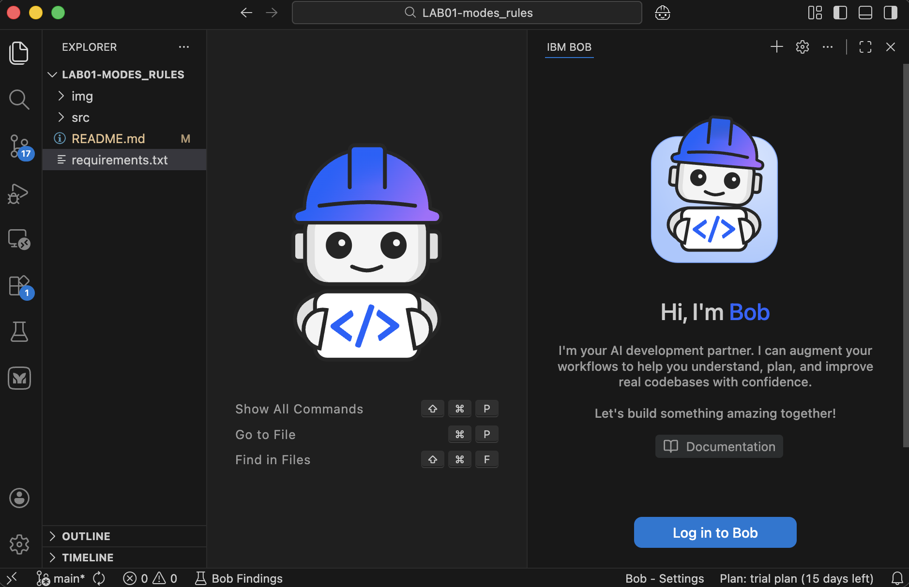
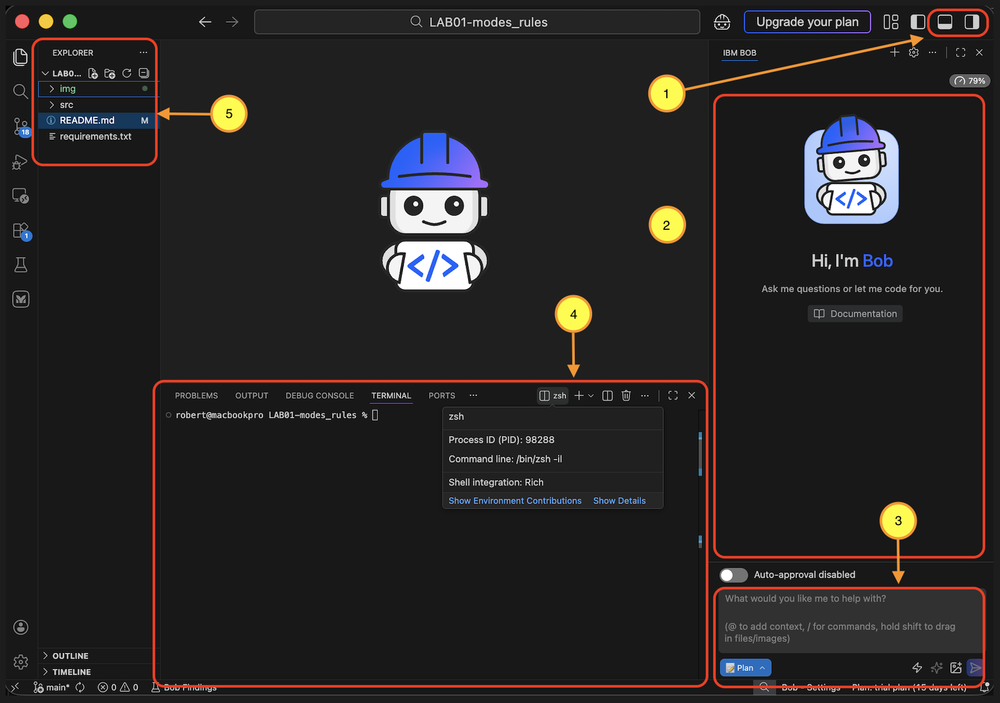

# Custom Modes - Test Engineer Mode Demonstration

## Overview

This lab demonstrates how to create and use custom modes in Bob IDE through a practical **Test Engineer Mode** example. You'll learn how to create specialized AI agent with focused expertise and safety guardrails.


We've prepared a sample backend application that needs to be tested. With IBM Bob mode we will write tests that a Test Engineer would normally prepare. It will cover unit tests for REST API endpoints and also demonstrate the test coverage of the created tests.


## What You'll Learn

This hands-on lab teaches you how to create specialized AI agent in Bob IDE by building a complete Test Engineer mode from scratch. You'll master three core customization features:

- Custom Modes - Create focused AI agent with specific expertise - Test Engineer in this case.
- Rules - Define behavioral rules the Agent must comply with
- Slash-Commands - Build reusable prompt templates for common workflows

## Why Test Engineer Mode?

The Test Engineer mode is an ideal demonstration because it:
- ✅ **Universal relevance** - Every developer writes tests
- ✅ **Clear safety demonstration** - Can't accidentally break production code
- ✅ **Simple to understand** - Focused, single purpose
- ✅ **Shows file regex** - Clear pattern for test files
- ✅ **Practical workflow** - Real-world separation of concerns


#### Setup Project Structure:
```
project/
├── src/
│   ├── converter.py          (production code)
├── requirements.txt          (Python dependencies/packages needed to run and test the code)
├── images                    (list of images used in the README.md file)
└── README.md                 (this file, LAB instructions)
```

### Prerequisites

1) You must have installed IBM Bob IDE. [download](https://bob.ibm.com)
2) You must have an active IBM Bob subscription (free trial is available [here](https://bob.ibm.com/trial))


### Lab 0: Setup the lab environment (10 minutes)

1. **Download the Repository:**
   - Clone the repository from GitHub: `git clone [repository-url]`
   - Or download the ZIP file and extract it to your local computer

2. **Open in IBM Bob:**
   - Launch IBM Bob IDE
   - Navigate to **File → Open Folder**
   - Select the `LAB01-modes_rules` directory
   - This directory must be your root project folder in IBM Bob
   - Your workspace should now display the project structure with `src/` folder and `README.md` `requirements.txt` files.



3. **Login to IBM Bob**
   - Hit the button `Log in to Bob`
   - Enter the IBMid credentials (your e-mail, and password used during registration for trial or other subscription)


4. **Familiarize Yourself with IBM Bob Interface**
   
   There are 5 main sections in the interface you need to be familiar with:
   
   - **Section 1 (Top Right part)**: Toggle between Terminal view (icon with white stripe on bottom) and Chat interface (icon with white stripe on right)
   - **Section 2 (Middle part)**: This is the area where you will be able to edit generated or existing files. Main editor area.
   - **Section 3 (Bottom Right)**: The chat area where you will paste your prompts/instructions/commands to Bob
   - **Section 4 (Bottom)**: The utilities including tab for starting terminal shell sessions. You can have several terminal shell sessions here by clicking the + icon next to the shell name (zsh in this example)
   - **Section 5 (Right)**: Structure of the folders and files Bob will be working on



5. **Set up the Python environment and run the example application**

**Aplication to be tested**

We have prepared a simple backend application for which we will automatically generate tests. This application uses the FastAPI Python framework to expose three endpoints via a REST API. It is only an example - you can use your own application or one you download - but for this lab, we will use the prepared app located in the `src/` directory.

To run the application, you first need to install the required Python packages. You can install them globally, but the recommended approach is to create a virtual environment in a `.venv` directory within your project.

You will need a terminal to run the commands. Once everything is set up, you will be able to start the application and proceed with automatically generating tests.

The backend application is called `converter`, and its source code is located in `src/converter.py`. It exposes the following REST API endpoints:

* `http://localhost:8000/ping` — used to check if the application is running
* `http://localhost:8000/convert/yaml-to-json` — converts YAML text to JSON
* `http://localhost:8000/convert/json-to-yaml` — converts JSON to YAML


**How to run the application** 

- Open a terminal in the IBM Bob IDE. Your current directory should be `LAB01-modes_rules`.
- Run `python -m venv .venv` - this creates a `.venv` directory in your project. It will serve as your local Python environment.
- Activate the virtual environment by running `source .venv/bin/activate` - from now on, all Python packages will be installed in the `.venv` directory. (You can deactivate it later with the `deactivate` command.)
- Now, inform the IBM Bob IDE (like in regular VSCode) to use new virtual environment by :
   - Pressing `Ctrl+Shift+P`
   - Choosing `Python: Select Interpreter`
   - Choose the interpreter from your .venv (e.g. .venv/bin/python)
   - Restart the IDE, by pressing `Ctrl+Shift+P` and choosing `Developer: Reload Window`
- Install the required packages by running `pip install -r requirements.txt`.
- Start the application with `python src/converter.py`.
- Open a web browser and go to `http://localhost:8000/docs` to view the API documentation and confirm that the application is running.

Congratulations! The application to be tested is up and running and ready to be tested.

### Lab 1:  Create the Mode (3 minutes)

Goal: Learn how to create a custom mode by defining its identity, behavior, and file access restrictions through YAML configuration.

What You'll Learn:
This lab teaches you the fundamental structure of custom modes in Bob IDE. You'll create a Test Engineer mode 

Outcome: After completing this lab, you'll have a working Test Engineer mode that appears in your mode selector and enforces strict file access rules, providing a safe environment for test development.

#### Create a custom mode

Modes are specialized personas that tailor Bob’s behavior to specific tasks. In this lab, IBM Bob will act as a Test Engineer responsible for writing tests.

IBM Bob comes with several predefined modes:

* `code` — general-purpose coding tasks, optimized for cost efficiency
* `ask` — conversational questions and information about your code
* `plan` — high-level planning and big-picture thinking
* `advanced` — advanced coding tasks requiring access to MCP tools
* `orchestrator` — can switch between modes for complex projects that require coordination across multiple specialties and workflows

In this lab, we will create an additional custom mode that acts as a Test Engineer responsible for writing tests. This mode will follow specific rules defining how tests should be implemented.

All custom modes are defined in a YAML file located in the `.bob` directory, in a file named `custom_modes.yaml`. This file contains all defined custom modes. For our `Test Engineer` mode, we define a single entry in the `customModes` list. While the list currently contains only one item, you can add more modes as needed.

Let’s take a closer look at what such an item looks like:

```yaml
customModes:
  - slug: test-engineer
    name: 🧪 Test Engineer
    description: mode used for writing tests
    roleDefinition: |
      You are a test automation specialist with expertise in writing comprehensive, 
      maintainable tests. You focus on test quality, coverage, and best practices 
      while ensuring production code remains untouched.
    whenToUse: |
      Use this mode for:
      - Creating new test files and test suites
      - Updating existing tests
      - Debugging failing tests
      - Reviewing test coverage
      - Setting up test infrastructure
    customInstructions: |
      ## Testing Standards
      - Follow AAA pattern (Arrange, Act, Assert)
      - Write descriptive test names that explain the scenario
      - Include both positive and negative test cases
      - Mock external dependencies appropriately
      - Aim for high code coverage without sacrificing quality
      
      ## Safety Rules
      - NEVER modify production code (non-test files)
      - Only edit files matching test patterns
      - If production code needs changes, recommend them but don't implement
      
      ## Test Structure
      - Group related tests in test classes or functions
      - Use pytest fixtures for setup/teardown
      - Keep tests independent and isolated
      - Avoid test interdependencies

      ## Mode Switching
      - Never switch to a different mode.
      - Never propose switching to a different mode.
    groups:
      - read
      - - edit
        - fileRegex: test_.*\.py$|.*_test\.py$\.(test|spec)\.(py)$
          description: Python test/specs files only
```

As you can see, the mode definition is a narrative description that outlines the role of our Test Engineer, including custom instructions on how it should behave and the name of the mode. There is also a field called `slug`, which serves as the unique identifier of the mode. We will use it later when defining the rules that our Test Engineer should follow.

An important part of the definition is the `groups` section, which specifies what actions (or tools) are available to this mode. It defines that the “Test Engineer” can:

* read files from the file system
* edit files in the file system, but only those whose names match the `fileRegex` pattern (i.e., test files with a `.py` extension)

This restriction is particularly important because, in real-world scenarios, testers should not modify the source code being tested. Their responsibility is limited to writing automated tests. It is the developer’s responsibility to update the source code if tests reveal bugs or issues.

Here is a brief description of the mode definition sections:

| Component              | Purpose               | Value                            |
| ---------------------- | --------------------- | -------------------------------- |
| **slug**               | Unique identifier     | `test-engineer`                  |
| **name**               | Display name          | `🧪 Test Engineer`               |
| **roleDefinition**     | Core identity         | Test automation specialist       |
| **whenToUse**          | Orchestrator guidance | Test-related tasks               |
| **customInstructions** | Behavioral rules      | AAA pattern, safety rules        |
| **groups**             | Available tools       | read, edit (restricted).         |


#### Add the Custom Mode

1. Create the `.bob` directory in your project root if it doesn't exist
2. Create or open `.bob/custom_modes.yaml`
3. Paste the configuration of the mode from above example
4. Save the file
5. Verify the mode appears in the mode selector dropdown
6. Switch to the new mode Test Enginieer by clicking on it in the dropdown


### Lab 2: Testing Access to App Source Code (2 minutes)

**Goal:** Demonstrate why custom modes matter and how file access restrictions work

1. **Switch to Test Engineer Mode:**
   - Open the mode selector in Bob IDE
   - Select "🧪 Test Engineer" mode

2. **Test the Safety Guardrails:**
   - Send the following prompt to Bob:
   ```
   Add a detailed comment above the ping method in the /src/converter.py file explaining that this method must have comprehensive test coverage including unit tests for all possible return values, edge cases, error conditions, and integration scenarios to ensure reliability and maintainability of the codebase.
   ```

3. **Observe the Result:**
   - Bob will refuse to modify the production file
   - Expected response: **"I cannot modify the production code file src/converter.py as I'm in Test Engineer mode, which only allows editing test files. According to my safety rules, I should never modify production code."**
   - This demonstrates the file access restrictions working correctly

### Lab 3: Add additional rules for the Test Engineer mode (5 minutes)

**Goal:** Add additional rules for the Test Engineer mode, as is common in real-world scenarios where every company has its own rules for how tests are conducted and which tools are used.

1. **Set up rules the Test Engineer must follow**

You can define specific rules for each custom role in IBM Bob.
Rules are narrative descriptions of guidelines that the agent must follow.

To set up rules for a specific custom mode, you need to know its `slug`. The `slug` is the unique identifier of the mode and can be found in the `.bob/custom_modes.yaml` file.
In our case, the `slug` for "Test Engineer" is `test-engineer`.

   -  Create a directory using your terminal by running:
  `mkdir .bob/rules-test-engineer`

  This type of directory can be created for any custom mode. The naming is important and must follow the pattern: **rules-{slug_of_the_mode}**

   -  Create a file named `testing-rules.md` in the `.bob/rules-test-engineer` directory and paste the following content:

```Markdown
# Testing

- Always run Python tests with `python -m pytest`, never with bare `pytest`.
- When suggesting or executing a test command, use the form `python -m pytest ...`.
- For a single test file, use `python -m pytest tests/test_file.py -v`.
- For a single test, use `python -m pytest tests/test_file.py::test_name -v`.
- Do not use alternative Python test runners unless explicitly requested.
- Always include an example test invocation in the summary.
- The test needs genuinely invalid YAML, such as: "unclosed quote, key: [unclosed bracket, invalid: : double colon etc.

## Test Structure

- All tests must be located in the `tests/` directory at the root of the project.
- Do not place tests inside source directories (e.g. `src/`).
- New tests must always be created under `tests/`.
- Test files should follow the naming convention `test_*.py`.
```

As you can see, this can be any narrative text describing which tools the Test Engineer should use, where test scripts should be created, and any other relevant guidelines.

   - Save the file

   - Ensure you're in Test Engineer mode

   - verify that the rules are applied by entering the following prompt in the chat window:
  `make a dummy test file single test that will be used as a template for other tests`

   - Check the results. If the rules are working correctly, the dummy template test file should be created in the `tests/` directory, as defined in the `testing-rules.yaml` file.


### Lab 4: Write Tests for Specific FastAPI Function (5 minutes)

**Goal:**
Create a comprehensive pytest test suite for a simple FastAPI ping function to validate its behavior across normal, edge, and error scenarios.

**Steps:**
0. **start new task in IBM Bob**

1. **Ensure you're in Test Engineer mode**
   The rules defied are valid for "Test Engineer" role. Ensure you are in the correct mode before proceeding.

2. **Send the following prompt:**
   ```
   Create a comprehensive test file named test_ping.py that contains unit tests for the ping function located in the src/converter.py module. The test file should include multiple test cases covering normal operation, edge cases, error handling, and various input scenarios. Use pytest as the testing framework and include appropriate fixtures, assertions, and test documentation. Ensure the tests verify the function's return values, side effects, and behavior under different conditions. Include tests for success cases, failure cases, boundary conditions, and any exception handling. Add proper imports, setup and teardown methods if needed, and follow Python testing best practices with clear test names that describe what is being tested.
   ```

3. **review the generated test file**
   Review and adjust tests if needed in file test/test_ping.py (e.g., type issues or invalid inputs)

4. **Verify the tests:**
   Now execute the tests to verify they work correctly using you Terminal in IBM Bob:

   ```bash
   source .venv/bin/activate 
   python -m pytest tests/test_ping.py -v
   ```

5. **Expected Result:**
   - A complete tests/test_ping.py file is created
   - Tests cover success cases, failures, and edge conditions
   - Proper pytest structure (fixtures, AAA pattern, clear naming) is used
   - All tests pass successfully when executed


### Lab 5: Write Tests for Other FastAPI Function (5 minutes)

**Goal:** Create comprehensive test suites for additional API endpoints

**Steps:**

0. **start new task in IBM Bob**

1. **Ensure you're in Test Engineer mode**

2. **Send the following prompt:**
   ```
   Create comprehensive test suites for convert_json_to_yaml FastAPI function exposed as REST API in the src/converter.py module, with each function's tests in a separate file named test_<function_name>.py. Each test file must include extensive test coverage encompassing normal operation scenarios with typical valid inputs and edge cases.
   ```

3. **Expected Result:**
   - ✅ Bob creates `tests/test_convert_json_to_yaml.py`
   - Tests cover normal operation with valid inputs
   - Tests include edge cases and error scenarios
   - Tests verify API response structure and status codes

4. **Run the tests:**
   ```bash
   source .venv/bin/activate
   python -m pytest tests/test_convert_json_to_yaml.py -v
   ```

5. **Review the output:**
   - Verify results of all tests


### Lab 6: Add a Slash Command to Speed Up Interactions (5 minutes)

**Goal:**
Create a custom IBM Bob slash command that generates a Python/FastAPI test coverage analysis report, then run it and review the output for gaps in coverage.

**Steps:**
0. **Start a new task in IBM Bob**

1. **Ensure you're in Test Engineer mode**
   The rules defined are valid for the **Test Engineer** role. Ensure you are in the correct mode before proceeding.

2. **Create the slash-command file**
   In your project root, create this file:

   ```bash
   mkdir -p .bob/commands
   ```

   Then create:

   ```bash
   .bob/commands/test-coverage.md
   ```

3. **Paste the following content into the file:**

   ```
   ---
   description: "Calculates test coverage in source code."
   ---

   Create a comprehensive test coverage analysis report that examines Python source code and test files to display summary report code coverage metrics, including percentage of lines covered, uncovered code sections, branch coverage, and function coverage, specifically analyzing FastAPI applications with pytest test suites, identifying gaps in test coverage for modules, generating summary reports showing which lines and functions are tested versus untested, supporting multiple test files across different test suites, and producing actionable insights about areas requiring additional test coverage to improve overall code quality and reliability.
   DO NOT run any tools.
   ```

4. **Run the slash command in IBM Bob**
   In the Bob interaction window, type:

   ```text
   /test-coverage
   ```

   Then send it.

5. **run the suggested pytest command to check the test coverage**
   In terminal window:
   ```bash
   python -m pytest tests/ --cov=src --cov-report=term-missing -v
   ```
   
5. **Analyze the results**
   Review the generated coverage analysis and check for:

   * modules with low or missing coverage
   * uncovered lines or branches
   * untested functions
   * suggested areas for additional tests
   * whether the report correctly reflects the FastAPI app and pytest suite structure

6. **Expected Result:**

   * A custom slash command is available in IBM Bob
   * The `/test-coverage` command runs successfully
   * A coverage analysis report is generated
   * The suggested pytest command generates output simillar to:
   ```
   ======================================= tests coverage =======================================
   _____________________ coverage: platform darwin, python 3.12.12-final-0 ______________________

   Name               Stmts   Miss  Cover   Missing
   ------------------------------------------------
   src/__init__.py        0      0   100%
   src/converter.py      58     21    64%   30-35, 48-51, 62-63, 68-77, 95-97
   ------------------------------------------------
   TOTAL                 58     21    64%
   ===================================== 97 passed in 1.20s =====================================
   ```
   * The report highlights tested vs. untested code
   * You can identify concrete areas where more tests are needed


### Lab 7: (Optional) Create and Run Additional Test Files

**Objective:** Create and run additional test files to achieve 100% coverage of the application’s source code.

The current test coverage is 64%, which means that 64% of the source code is covered by the test suite. Your task is to create additional test files to reach 100% coverage.

`TIP:` Each time you run the test generation task, start it as a new task to preserve the context window.


## Resources

- **Documentation**: `DOCS/21-custom_modes.md`
- **Regex Testing**: https://regex101.com
- **YAML Validation**: https://www.yamllint.com
- **Example Modes**: `.bob/custom_modes.yaml` in this repository

---

**Lab Duration:** 15-20 minutes  
**Difficulty:** Intermediate  
**Prerequisites:** Basic understanding of Bob IDE and file patterns