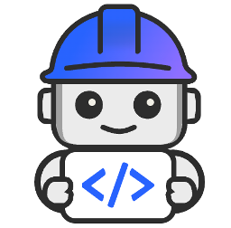

<div align="center">



# IBM BOBATHON AMSTERDAM 🇳🇱

<pre>
╔══════════════════════════════════════════════════════════════════════════════╗
║   ██████╗  ██████╗ ██████╗  █████╗ ████████╗██╗  ██╗ ██████╗ ███╗   ██╗   ║
║   ██╔══██╗██╔═══██╗██╔══██╗██╔══██╗╚══██╔══╝██║  ██║██╔═══██╗████╗  ██║   ║
║   ██████╔╝██║   ██║██████╔╝███████║   ██║   ███████║██║   ██║██╔██╗ ██║   ║
║   ██╔══██╗██║   ██║██╔══██╗██╔══██║   ██║   ██╔══██║██║   ██║██║╚██╗██║   ║
║   ██████╔╝╚██████╔╝██████╔╝██║  ██║   ██║   ██║  ██║╚██████╔╝██║ ╚████║   ║
║   ╚═════╝  ╚═════╝ ╚═════╝ ╚═╝  ╚═╝   ╚═╝   ╚═╝  ╚═╝ ╚═════╝ ╚═╝  ╚═══╝   ║
╚══════════════════════════════════════════════════════════════════════════════╝
</pre>

### 🚀 Build Enterprise AI Solutions with IBM Bob
**5 Hands-On Labs | 4-5 Hours Total**

[](https://bob.ibm.com)
[](https://www.ibm.com/watsonx)
[](https://kafka.apache.org)

</div>

---

## Welcome to IBM Bobathon Amsterdam Labs

This collection of hands-on labs demonstrates how to leverage **IBM Bob** as an AI development partner to build enterprise-grade solutions. From full-stack applications to event-driven agentic systems, you'll learn how AI can accelerate your development workflow.

## About IBM Bob

IBM Bob is an AI-powered development assistant that helps developers create, deploy, and manage applications more efficiently. Bob can generate code, create documentation, design architectures, and automate deployment workflows.

---

## Available Labs

### [Lab 1: Building a Todo Application with Bob](Lab%201%20-%20Building%20a%20Todo%20Application%20with%20Bob/)

**🚀 [START LAB 1 →](Lab%201%20-%20Building%20a%20Todo%20Application%20with%20Bob/README.md)** | ⏱️ 45 min | 📊 Beginner-Intermediate

Build a full-stack Todo app with Python Flask backend and JavaScript frontend. Master Bob's modes (Plan, Code, Ask), auto-approvals, and GitHub integration.

**What You'll Build:** Complete CRUD application with REST API, SQLite database, and version control

**Key Skills:** Bob modes, literate coding, MCP servers, full-stack development

---

### [Lab 2: Build Agentic Workflows on watsonx Orchestrate](Lab%202%20-%20Build%20Agentic%20Workflows%20Programmatically%20on%20watsonx%20Orchestrate%20Using%20IBM%20Bob/)

**🚀 [START LAB 2 →](Lab%202%20-%20Build%20Agentic%20Workflows%20Programmatically%20on%20watsonx%20Orchestrate%20Using%20IBM%20Bob/wxo-bob-lab.md)** | ⏱️ 60-75 min | 📊 Intermediate

Create an automated Expense Report Agent that processes invoices and extracts structured data using watsonx Orchestrate ADK and Bob.

**What You'll Build:** Document processing agent with structured data extraction (invoice info, airline details, fees)

**Key Skills:** MCP configuration, watsonx Orchestrate ADK, agent development, LLM integration

**Prerequisites:** [Complete setup guides first](Lab%202%20-%20Build%20Agentic%20Workflows%20Programmatically%20on%20watsonx%20Orchestrate%20Using%20IBM%20Bob/Prerequisites/)

---

### [Lab 3: Event-Driven Agentic AI with Kafka](Lab%203%20-%20Building%20an%20event-driven%20agentic%20AI%20system%20with%20Apache%20Kafka%20on%20Confluent%20Cloud%20and%20watsonx%20Orchestrate/)

**🚀 [START LAB 3 →](Lab%203%20-%20Building%20an%20event-driven%20agentic%20AI%20system%20with%20Apache%20Kafka%20on%20Confluent%20Cloud%20and%20watsonx%20Orchestrate/README.md)** | ⏱️ 90-120 min | 📊 Advanced

Build a real-time retail inventory system with three coordinated agents processing Kafka streams for live stock checks and product recommendations.

**What You'll Build:** Multi-agent system with SKU Availability Agent, Substitute Finder Agent, and Store Associate Supervisor

**Key Skills:** Kafka integration, ksqlDB, MCP toolkits, agentic RAG, multi-agent orchestration

---

### [Lab 4: Full SDLC Overview - Interactive Demo](Lab%204%20-%20Full%20SDLC%20overview%20—%20what%20Bob%20does,%20and%20why%20it%20matters%20/)

**🚀 [LAUNCH DEMO →](https://ibm-bobathon-amsterdam.s3-web.eu-de.cloud-object-storage.appdomain.cloud/stages/stage-0.html)** | ⏱️ 60 min | 📊 All Levels

Experience Bob's complete SDLC capabilities through an interactive demonstration covering 8 stages from app creation to Day-2 operations.

**What You'll See:** Payment app built from one prompt, test generation, security scanning, IaC, OpenShift deployment, CI/CD pipelines, SRE ops

**Key Skills:** Full SDLC understanding, spec-driven development, automated workflows

**Format:** Browser-based interactive demo (no installation required)

---

### [Lab 5: Custom Modes - Test Engineer Mode](Lab%205%20-%20Custom%20Modes%20-%20Test%20Engineer%20Mode%20Demonstration/)

**🚀 [START LAB 5 →](Lab%205%20-%20Custom%20Modes%20-%20Test%20Engineer%20Mode%20Demonstration/README.md)** | ⏱️ 35-40 min | 📊 Intermediate

Create specialized AI agents with custom modes, rules, and slash commands. Build a Test Engineer mode with safety guardrails and automated test generation.

**What You'll Build:** Custom Test Engineer mode that only edits test files, follows AAA pattern, and includes test coverage commands

**Key Skills:** Custom modes (YAML), behavioral rules, slash commands, file access restrictions, pytest

---

## Optional Workshop - IBM-i-Application-Modernization-with-Bob

Learn how to modernize legacy IBM i (AS/400) applications using IBM Bob. This workshop demonstrates using AI to transform RPG and COBOL code into modern languages and architectures.

**🚀 [LAUNCH →](https://github.com/bmarolleau/IBM-i-Application-Modernization-with-Bob)**

---

## Optional Lab for COBOL - Legacy Modernization

**🚀 [START LAB →](Optional%20Lab%20for%20COBOL/README.md)** | ⏱️ 30-45 min | 📊 Intermediate

Learn how to modernize legacy COBOL financial applications into modern Java microservices using IBM Bob. This hands-on workshop uses real IBM mainframe sample programs to demonstrate AI-powered modernization.

**What You'll Build:** Convert a COBOL financial calculator system (loan payments, present value) to Java with tests, GUI, and REST API

**Key Skills:** COBOL to Java conversion, legacy pattern recognition, financial calculations (BigDecimal), test-driven migration, REST API design

---

## Optional Lab for Bob Mastery

**🚀 [START LAB →](https://github.com/dzwietering/bobshop)** | ⏱️ 45 min | 📊 All Levels

A hands-on workshop designed to teach developers how to effectively use Bob, an AI-powered coding assistant. Features 4 progressive exercises teaching effective Bob usage, including facilitator guides and assessment materials.

**What You'll Learn:** Bob fundamentals, effective prompting, mode selection, collaboration patterns

**Key Skills:** AI-assisted development, prompt engineering, workflow optimization

---

## Learning Path

We recommend completing the labs in order:

1. **Lab 1** (45 min) - Learn Bob basics with a simple full-stack app
2. **Lab 2** (60-75 min) - Build programmatic agents with watsonx Orchestrate
3. **Lab 3** (90-120 min) - Create event-driven multi-agent systems
4. **Lab 4** (60 min) - Experience Bob's complete SDLC capabilities (interactive demo)
5. **Lab 5** (35-40 min) - Create custom modes with specialized AI agents

**Total Time**: 4-5 hours for all labs

## Repository Structure

📁 **[View Complete Repository Structure →](REPOSITORY-STRUCTURE.md)**

```
bobathon-amsterdam-labs/
├── Lab 1 - Building a Todo Application with Bob/
│   ├── README.md (714 lines) | solution/ | starter/
├── Lab 2 - Build Agentic Workflows.../
│   ├── Prerequisites/ | wxo-bob-lab.md (447 lines)
│   ├── .bob/rules/ | sample-pdfs/ | images/ (29)
├── Lab 3 - Building an event-driven agentic AI system.../
│   ├── README.md (499 lines) | assets/ | sample-transactions.json | images/ (20)
├── Lab 4 - Full SDLC overview.../
│   └── README.md (164 lines)
└── Lab 5 - Custom Modes - Test Engineer Mode Demonstration/
    ├── README.md (450 lines) | src/ | requirements.txt | images/ (2)
```

## Getting Started

1. Choose a lab from the list above
2. Navigate to the lab directory
3. Read the lab's README for an overview
4. Follow the step-by-step tutorial
5. Complete the hands-on exercises

## Support and Resources

- [IBM Developer](https://developer.ibm.com)
- [watsonx Orchestrate Documentation](https://developer.watson-orchestrate.ibm.com)
- [IBM Bob Documentation](https://www.ibm.com/products/bob)

## Contributing

This repository is maintained for educational purposes. For questions or feedback, please contact the lab authors.

---

**Happy Learning! 🚀**
