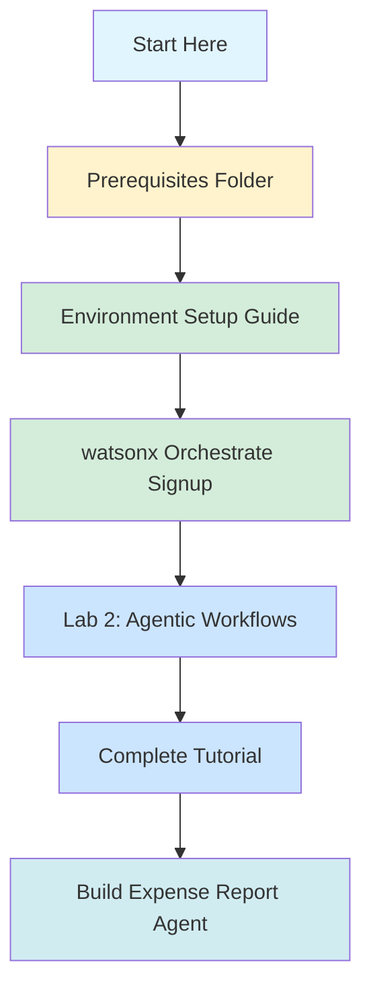

# Repository Structure

Visual overview of the IBM Bobathon Amsterdam Labs repository organization.

## Directory Tree

```
bobathon-amsterdam-labs/
├── README.md                          # Main repository overview
├── .gitignore                         # Git ignore rules
├── REPOSITORY-STRUCTURE.md            # This file
│
└── Lab 2 - Build Agentic Workflows Programmatically on watsonx Orchestrate Using IBM Bob/
    ├── Prerequisites/                 # Setup guides (complete first)
    │   ├── README.md                  # Prerequisites overview
    │   ├── environment-setup.md       # Python, Bob IDE, ADK, MCP setup
    │   └── watsonx-orchestrate-signup.md  # Free trial signup
    ├── README.md                      # Lab overview and objectives
    ├── wxo-bob-lab.md                 # Complete step-by-step tutorial
    ├── ibmid-registration.md          # IBMid creation for TechZone
    └── images/                        # 29 tutorial screenshots
        ├── 01-architecture-diagram.png
        ├── 02-architecture-table.png
        ├── 03-architecture-flow.png
        ├── 04-mcp-json-config.png
        ├── 05-bob-rule-wxo-development.png
        ├── 06-plan-mode-prompt.png
        ├── 07-bob-prompt-sent.png
        ├── 08-bob-approve-file.png
        ├── 09-bob-task-list.png
        ├── 10-bob-clarification.png
        ├── 11-bob-plan-complete.png
        ├── 12-workflow-diagram.png
        ├── 13-advanced-mode-implement.png
        ├── 14-bob-creates-flow.png
        ├── 15-bob-creates-agent-yaml.png
        ├── 16-bob-creates-import-script.png
        ├── 17-bob-creates-docs.png
        ├── 18-initialize-workspace.png
        ├── 19-environment-manager.png
        ├── 20-api-key-prompt.png
        ├── 21-bob-deploy-instruction.png
        ├── 22-bob-runs-import.png
        ├── 23-ibmcloud-resource-list.png
        ├── 24-wxo-launch-button.png
        ├── 25-manage-agents-search.png
        ├── 26-agent-config.png
        ├── 27-test-agent-upload.png
        ├── 28-agent-json-result.png
        └── 29-bob-all-tasks-complete.png
```

## Learning Path



## File Descriptions

### Root Level

| File | Purpose |
|------|---------|
| `README.md` | Main repository overview, lab listings, getting started guide |
| `.gitignore` | Specifies files/folders to exclude from version control |
| `REPOSITORY-STRUCTURE.md` | This file - visual guide to repository organization |
| `Lab 2 - Build Agentic Workflows Programmatically on watsonx Orchestrate Using IBM Bob/` | Complete Lab 2 with prerequisites and tutorial |

### Lab 2 - Build Agentic Workflows Programmatically on watsonx Orchestrate Using IBM Bob

#### Prerequisites Subfolder

| File | Purpose | Time |
|------|---------|------|
| `README.md` | Prerequisites overview and quick start checklist | 5 min |
| `environment-setup.md` | Install Python, Bob IDE, ADK, configure MCP servers | 30-45 min |
| `watsonx-orchestrate-signup.md` | Free trial signup and API setup | 10-15 min |

**Total Setup Time**: ~45-65 minutes

#### Lab Files

| File | Purpose | Lines |
|------|---------|-------|
| `README.md` | Lab overview, objectives, architecture, prerequisites | 203 |
| `wxo-bob-lab.md` | Complete step-by-step tutorial with 10 sections | 336 |
| `ibmid-registration.md` | IBMid creation guide for TechZone access | 168 |
| `images/` | 29 screenshots documenting each tutorial step | - |

**Lab Duration**: ~60-75 minutes

## Content Overview

### Lab 2 Prerequisites Content

**Environment Setup Guide** (in Lab2/Prerequisites/) covers:
- Python 3.11+ installation (Windows, macOS, Linux)
- IBM Bob IDE extension installation
- watsonx Orchestrate ADK installation
- MCP server configuration
- Verification steps
- Troubleshooting

**watsonx Orchestrate Signup Guide** covers:
- Free trial signup
- Accessing watsonx Orchestrate
- Generating API credentials
- Configuring ADK environment
- Connection verification
- Managing multiple environments

### Lab 2 Content

**Tutorial Sections**:
1. Overview - Introduction to wxO and agentic workflows
2. Architecture - System design and component flow
3. Prerequisites - Required setup verification
4. MCP Configuration - Optional server setup
5. Bob Rules - Development best practices
6. Plan Creation - Design agent with Bob's Plan mode
7. Implementation - Generate code with Bob's Advanced mode
8. Deployment - Import workflow and agent to wxO
9. Verification - Test agent functionality
10. Summary - Review and next steps

**What You'll Build**:
- Expense Report Agent
- Invoice Processing Flow
- Document extraction with KVP schema
- Structured JSON output
- Complete deployment scripts

## Navigation Guide

### For First-Time Users

1. **Start**: Read main [README.md](README.md)
2. **Navigate**: Go to [Lab 2](Lab%202%20-%20Build%20Agentic%20Workflows%20Programmatically%20on%20watsonx%20Orchestrate%20Using%20IBM%20Bob/)
3. **Setup**: Complete [Prerequisites](Lab%202%20-%20Build%20Agentic%20Workflows%20Programmatically%20on%20watsonx%20Orchestrate%20Using%20IBM%20Bob/Prerequisites/)
   - [Environment Setup](Lab%202%20-%20Build%20Agentic%20Workflows%20Programmatically%20on%20watsonx%20Orchestrate%20Using%20IBM%20Bob/Prerequisites/environment-setup.md)
   - [watsonx Orchestrate Signup](Lab%202%20-%20Build%20Agentic%20Workflows%20Programmatically%20on%20watsonx%20Orchestrate%20Using%20IBM%20Bob/Prerequisites/watsonx-orchestrate-signup.md)
4. **Learn**: Follow the [Tutorial](Lab%202%20-%20Build%20Agentic%20Workflows%20Programmatically%20on%20watsonx%20Orchestrate%20Using%20IBM%20Bob/wxo-bob-lab.md)

### For Returning Users

- **Quick Reference**: [Prerequisites README](Lab%202%20-%20Build%20Agentic%20Workflows%20Programmatically%20on%20watsonx%20Orchestrate%20Using%20IBM%20Bob/Prerequisites/README.md)
- **Troubleshooting**: Check individual guide troubleshooting sections
- **Lab Access**: Direct link to [Lab 2 Tutorial](Lab%202%20-%20Build%20Agentic%20Workflows%20Programmatically%20on%20watsonx%20Orchestrate%20Using%20IBM%20Bob/wxo-bob-lab.md)

## Key Features

### Lab 2 Folder Features

#### Prerequisites Subfolder
✅ Comprehensive setup guides
✅ Platform-specific instructions (Windows, macOS, Linux)
✅ Troubleshooting sections
✅ Verification steps
✅ Quick start checklist

#### Lab Content
✅ Complete tutorial (336 lines)  
✅ 29 step-by-step screenshots  
✅ Architecture diagrams  
✅ Code examples  
✅ Deployment scripts  
✅ Testing instructions  

## Technologies Covered

- **IBM Bob**: AI-powered development assistant
- **watsonx Orchestrate**: Enterprise agentic AI platform
- **ADK (Agent Development Kit)**: Pro-code agent development
- **MCP (Model Context Protocol)**: Bob-wxO integration
- **Python 3.11+**: Runtime environment
- **VS Code**: Development IDE
- **IBM Cloud**: Cloud platform
- **LLM**: `groq/openai/gpt-oss-120b`

## Repository Statistics

- **Total Guides**: 5 (3 prerequisites + 2 lab)
- **Total Screenshots**: 29
- **Total Documentation Lines**: ~1,400+
- **Estimated Completion Time**: 2-2.5 hours (including setup)
- **Difficulty Level**: Intermediate
- **Prerequisites**: Basic Python knowledge, command-line familiarity

## Future Labs

This repository structure is designed to accommodate additional labs:

```
bobathon-amsterdam-labs/
├── Lab 1 - [Topic]/              # Future lab
│   └── Prerequisites/            # Lab-specific setup
├── Lab 2 - Build Agentic Workflows Programmatically on watsonx Orchestrate Using IBM Bob/
│   └── Prerequisites/            # Lab-specific setup
├── Lab 3 - [Topic]/              # Future lab
│   └── Prerequisites/            # Lab-specific setup
└── Lab 4 - [Topic]/              # Future lab
    └── Prerequisites/            # Lab-specific setup
```

Each lab will:
- Include its own Prerequisites folder with setup guides
- Have its own README and tutorial
- Provide complete documentation
- Include visual aids and examples

---

## Quick Links

- 📖 [Main README](README.md)
- 🚀 [Lab 2: Build Agentic Workflows Programmatically](Lab%202%20-%20Build%20Agentic%20Workflows%20Programmatically%20on%20watsonx%20Orchestrate%20Using%20IBM%20Bob/)
- 🔧 [Lab 2 Prerequisites](Lab%202%20-%20Build%20Agentic%20Workflows%20Programmatically%20on%20watsonx%20Orchestrate%20Using%20IBM%20Bob/Prerequisites/)
- 📚 [watsonx Orchestrate Docs](https://developer.watson-orchestrate.ibm.com)
- 💡 [IBM Developer](https://developer.ibm.com)

---

**Last Updated**: May 6, 2026